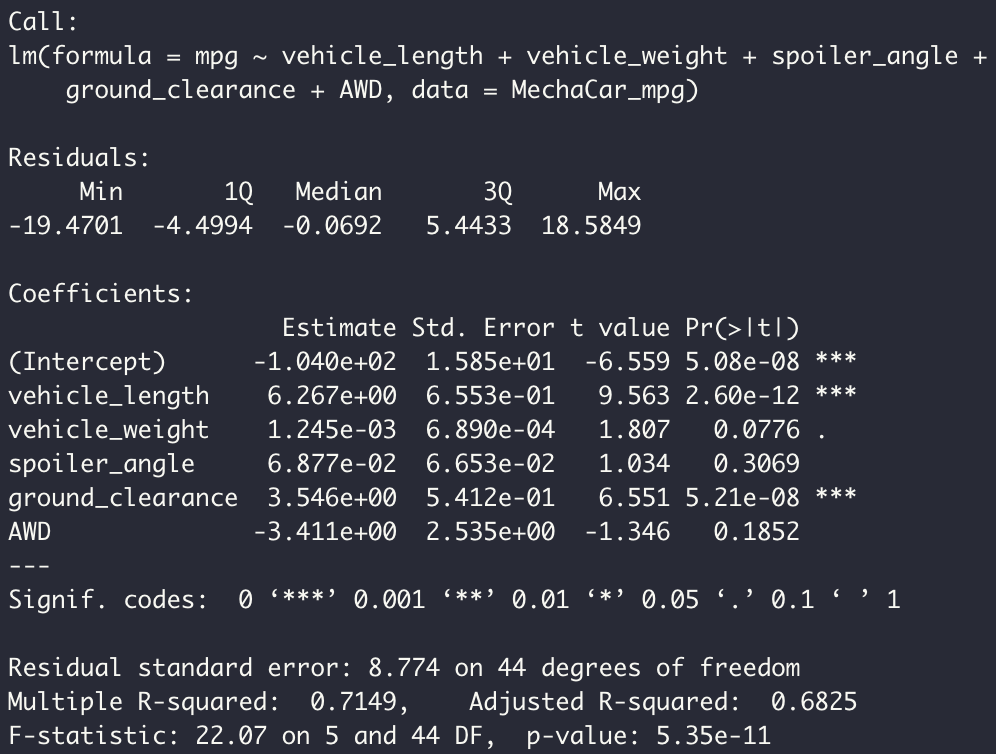

# MechaCar_Statistical_Analysis

## Linear Regression to Predict MPG
The MechaCar_mpg.csv file was uploaded as a dataframe, and linear regression was performed in order to predict the mpg of MechaCar prototypes.

- Which variables/coefficients provided a non-random amount of variance to the mpg values in the dataset?
From the linear regression test shown above, we can see that the variables that provided a non-random amount of variance to the mpg values were the vehicle length and the ground clearance. This means that those two variables do have significant impact on the miles per gallon of the prototype.

- Is the slope of the linear model considered to be zero? Why or why not?
The slope of the linear model is not considered to be zero because the low p-value of 5.35e-11 (which is slower than the 0.05 that would indicate statistical significance) helps suggest that the slope is not zero.

- Does this linear model predict mpg of MechaCar prototypes effectively? Why or why not?
The linear model does not predict the mpg of the prototypes effectively because although the r-squared values, both the multiple r-squared and the adjusted r-squared are around 0.7, which can seem high, this does not necessarily mean it is a good predictor. When speaking in relation to the low amount of data available, this r-squared value is not sufficient to precit the mpg effectively.

## Summary Statistics on Suspension Coils
The suspension coils dataset was used to create two summaries that showcase summary statistics for all manufacturing lots together, (the total summary) and the individual summary by lot (lot summary).

Total Summary:

Lot Summary:

- The design specifications for the MechaCar suspension coils dictate that the variance of the suspension coils must not exceed 100 pounds per square inch. Does the current manufacturing data meet this design specification for all manufacturing lots in total and each lot individually? Why or why not?
Since the variance of all lots together is 62.29 psi and is below 100 pounds per square inch, the data does meet the design specification for all lots in total. When speaking in terms of the individual lots, Lot 1, with a variance of 0.97 psi and Lot 2, with a variance of ahout 7.47 psi, both meet the design specification. Lot 3, however, has a variance of about 170.28, which is much higher than the required specification of 100 psi, so Lot 3 does not meet the design specification and is also causing the resulting variance for all lots in total to be higher than it would be.

## T-Tests on Suspension Coils
T-tests were performed to determine if the PSI across all manufacturing lots and the PSI across each lot individually is statistically different from the population mean of 1,500 PSI.

t-test result for ALL manufacturing lots:

The t-test above shows that the mean of the sample, as can also be seen in the "Mean" section of the total summary table, is 1,498.78 psi. The resulting p-value is 0.06, and assuming our siginifcance level is 0.05, we can assume that we do not have sufficient evidence to reject the null hypothesis, meaning that the mean for all manufacturing lots of 1,498.78 psi is statistically similar to the population mean of 1,500 psi.

t-test result for Lot 1:

The t-test result above shows that the mean for lot 1, as can also be seen in the "Mean" section of the lot summary table for Lot 1, is 1,500 psi. The resulting p-value is 1, which is above the siginifcance level of 0.05, so we can assume that we do not have sufficient evidence to reject the null hypothesis, as there is no difference statistically from Lot 1's resulting mean and the population mean of 1,500 psi.

t-test result for Lot 2:

The t-test above shows that the mean for lot 2, as can also be seen in the "Mean" section of the lot summary table for Lot 2, is 1,500.2 psi. The resulting p-value is about 0.6, which is above the siginifcance level of 0.05, so we can assume that we do not have sufficient evidence to reject the null hypothesis, meaning that the mean for Lot 2 of 1,500.2 psi is statistically similar to the population mean of 1,500 psi.

t-test result for Lot 3:

The t-test above shows that the mean for lot 3, as can also be seen in the "Mean" section of the lot summary table for Lot 3, is 1,496.14 psi. The resulting p-value is 0.041, and which is below the siginifcance level is 0.05, so we can reject the null hypothesis, meaning that the mean for Lot 3 of 1,496.14 psi is not statistically similar to the population mean of 1,500 psi.

## Study Design: MechaCar vs Competition
To analyze how MechaCar performs when compared to its competition, we would start by gathering data on cars that have similar features as the MechaCars, for example, a similar engine type, color, similar maintenance costs, similar horsepower/torque, similar fuel efficiency, and similar safety ratings. The metric I would want to test is how the cost of MecaCars compare to the cost of the competitor cars that have similar features as the MechaCars. My null hypothesis would be that the MechaCar cost is priced well based on its features when compared to competitor cars of similar features. The statistical test I would perform would be a multiple linear regression test to better assess which features best help predict the car's cost and what the resulting r-squared and p-value is.
